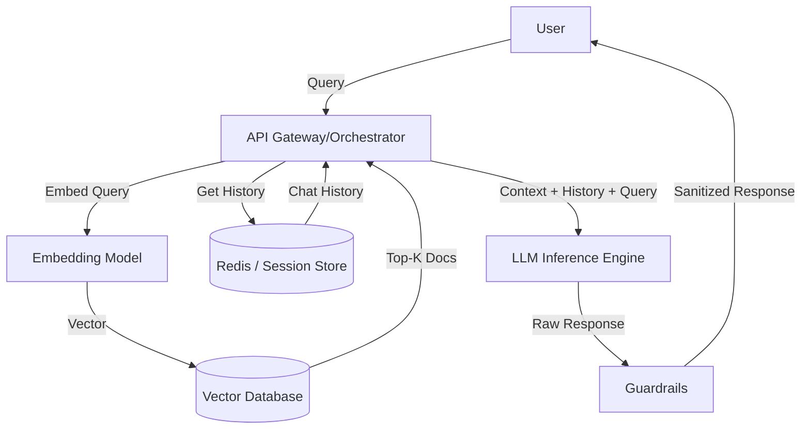

# Assignment 2: Technical Assessment & Architectural Approach

## 1. Self-Assessment Ratings

- **AI:** **A** (Can code independently)
- **ML:** **A** (Can code independently)
- **LLM:** **A** (Can code independently)
- **Deep Learning:** **B** (Can code under supervision)

> **Context:** My "A" rating in LLM/ML is backed by my work on _EdgeRAG_, where I independently built a quantization pipeline and custom retrieval loops. I rated Deep Learning as "B" because while I can implement standard architectures (ResNet, Transformers), I prefer supervision when designing novel model architectures from scratch.

---

## 2. Key Architectural Components of an LLM-Based Chatbot

Building a production-grade chatbot is rarely just "calling an API." It requires a system of components working in concert to handle state, context, and retrieval. Below is the high-level approach I typically follow, focusing on the **RAG (Retrieval-Augmented Generation)** pattern to solve the "hallucination" and "knowledge cutoff" problems inherent in raw LLMs.

### **High-Level Approach**

The core philosophy is **"Retrieved Context as Ground Truth."** Instead of relying on the LLM's internal weights for facts, we use the LLM primarily as a reasoning engine. The architecture treats the user's query not just as a prompt, but as a search signal.

1.  **Ingestion Pipeline:** Data is chunked and embedded offline.
2.  **Retrieval Loop:** The user's query is converted to a vector; we fetch the "Top-K" most relevant chunks.
3.  **Generation:** The retrieved chunks + user query are wrapped in a system prompt and sent to the LLM.
4.  **Guardrails:** The output is validated for safety and format before reaching the user.

### **Key Architectural Components**

#### **A. The Orchestrator (The "Brain")**

- **Role:** Manages the flow of data. It doesn't "think," it routes.
- **Technology:** LangChain, LangGraph, or a custom Python loop.
- **Why it matters:** In complex chats, we often need "Agentic" behavior where the bot decides _if_ it needs to search a database or _if_ it can answer from memory. The orchestrator handles this logic.

#### **B. The Vector Store (Long-Term Memory)**

- **Role:** Holds the domain knowledge (PDFs, docs, wikis) as numerical embeddings.
- **Key Feature:** Semantic Search. It finds data that _means_ the same thing as the query, even if the words are different.

#### **C. Contextual Memory (Short-Term State)**

- **Role:** Remembers the immediate conversation history (e.g., "What was the code you just showed me?").
- **Implementation:** Fast databases like Redis are used to store the `session_id` and the last $N$ turns of conversation.
- **Challenge:** LLMs have a context window limit. We often use a "Summary Buffer" approach, where older messages are summarized by a smaller model to save space.

#### **D. The LLM (Inference Engine)**

- **Role:** The generative component.
- **Selection Criteria:**
  - **Latency:** Smaller models (Llama-3-8B, GPT-3.5) for fast chat.
  - **Reasoning:** Larger models (GPT-4o, Claude 3.5 Sonnet) for complex analysis.
  - **Cost:** Balancing token usage against quality.

#### **E. Guardrails & Safety Layer**

- **Role:** Prevents the bot from discussing forbidden topics (PII, competitor mentions, toxic content).
- **Implementation:** Tools like NVIDIA NeMo Guardrails or simple Pydantic validators that check the output before showing it to the user.

### **System Architecture Diagram**

Below is the architectural flow for a standard RAG-based Chatbot (Rendered using Mermaid):

---

## 3. Vector Databases: Explanation & Selection Strategy

### **What is a Vector Database?**

Traditional databases (SQL) are excellent at exact matches (e.g., `WHERE id = 123`). However, human language is messy. If a user searches for "automobile," a SQL database might miss a document that only says "car."

A **Vector Database** solves this by storing data as **Embeddings** long lists of numbers (vectors) that represent semantic meaning. It uses algorithms like **HNSW (Hierarchical Navigable Small World)** graphs to perform Approximate Nearest Neighbor (ANN) search. This allows us to find documents that are _conceptually close_ to the query vector, rather than just matching keywords.

### **Hypothetical Problem Scenario**

**Problem:** _Building a "Legal Precedent Search Engine" for a Law Firm._

- **Constraints:**
  1.  **Data Privacy:** Client data is extremely sensitive and cannot leave the firm's private VPC (Virtual Private Cloud).
  2.  **Accuracy:** Lawyers need precise results; "hallucinated" cases are unacceptable.
  3.  **Hybrid Search:** Lawyers often search by concept ("breach of contract") AND by strict metadata ("Year > 2020", "Judge = Smith").

### **Selected Database: Qdrant**

If I were architecting this Legal Search Engine, I would select **Qdrant**.

### **Why Qdrant? (Technical Justification)**

| Feature                    | Why it matters for this problem                                                                                                                                                                                                                                     |
| :------------------------- | :------------------------------------------------------------------------------------------------------------------------------------------------------------------------------------------------------------------------------------------------------------------ |
| **Rust-Based Performance** | Qdrant is built in Rust, offering extremely low latency and high stability under load without the overhead of JVM-based garbage collection (unlike some competitors).                                                                                               |
| **Native Hybrid Search**   | Legal search requires strict filtering. Qdrant allows "Payload Filtering" directly in the HNSW graph traversal. This means I can filter by `Judge="Smith"` _while_ performing the vector search, rather than filtering _after_ (which is slower and less accurate). |
| **Deployment Flexibility** | It provides a standalone binary and a Docker image. It is fully open-source and can be self-hosted on the law firm's on-premise servers (Air-gapped if necessary), satisfying the strict **privacy constraint**.                                                    |
| **Developer Experience**   | It has a very clean Python SDK and supports asynchronous operations, which integrates perfectly with modern FastAPI backends.                                                                                                                                       |

### **Alternative Consideration**

While **Milvus** is a strong contender for massive scale (billions of vectors), its architecture is complex (requires etcd, MinIO, Pulsar). For a specialized internal tool like a Legal Search Engine, Qdrant's single-binary simplicity reduces maintenance overhead significantly.
